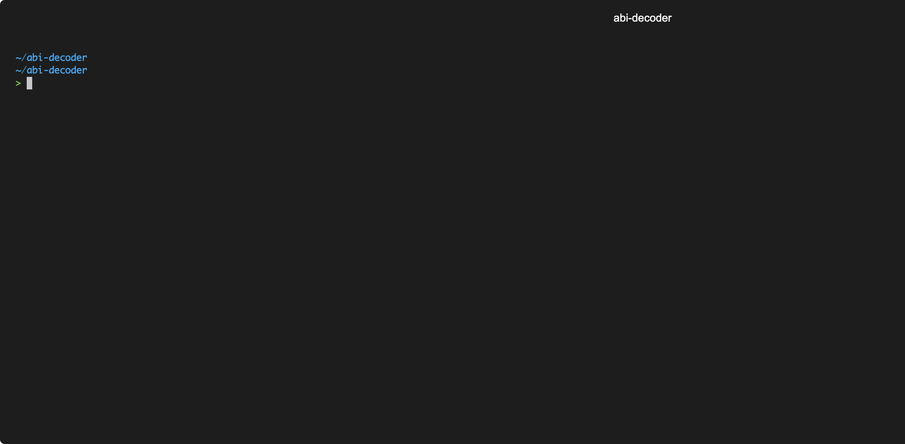

# Decode calldata without abi specification
This little program attemps to determine the structure of abi encoded data without knowing the abi specification.
It was inspired by [this excellent talk](https://www.youtube.com/watch?v=RZytWxtKODg) and primarily served as a learning project to better understand abi encoding and learn rust programming.



# How to use it
## Decode calldata from given transaction
`cargo run 0x0031bd14c2a69ae3b4e1fbb986f7f5de1424e9f35501d7f166d10103c82de1cc`

# How it works
The output of this program will always be a "best guess" among many potential data formats that could have been encoded to the given calldata.
The main assumption taken to get to  decide which potential decoding to suggest is to prefer dynamically sized types.
Therefore if a piece of data could be decoded as a dynamic array (i.e. `address[]`) or dynamic bytes / string this encoding is preferred over decoding the same piece of data as a collection of static types. (see below example for illustration)

## Example
The following (hex-encoded) data:
```
0: 0000000000000000000000000000000000000000000000000000000000000020
1: 0000000000000000000000000000000000000000000000000000000000000002
2: 0000000000000000000000000000000000000000000000000000000000000003
3: 0000000000000000000000000000000000000000000000000000000000000004
```

Can be decoded as an array of two elements (`3`, and `4`) because:
1. Word 0 (`32`) is a valid memory offset pointing to Word 1 
2. Word 1 (`2`) is a valid array length that consumes the rest of the available data

Changing word 0 or word 1 on its own in any way or appending / removing elements from the data would break these assumptions and lead to the data not being a valid array anymore.
Even though the same data could be decoded as individual pieces of staticly sized data (i.e. the numbers `32`, `2`, `3` and `4`) it would be quite a coincidence. Therefore the dynamic / "more structured" interpretation of the data as an array is assumed more likely.


